# GIT 

1. for initiate git first make test directory.In that directory init the git using following command.
```bash
    git init
   ```
 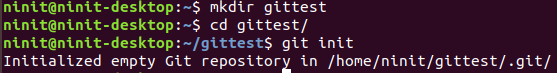

2. Now add content of our git repository use HTTP link of git repository. which is find by clicking on "clone or download"
   use following command to remote repository.
 ```
   git remote add origin https://github.com/bhargav-surani/work.git
   ```
 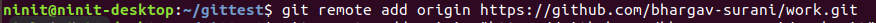
 
 3. Now for get all data or content of origin link use "pull" command.
 ```
   git pull origin master
   ```
 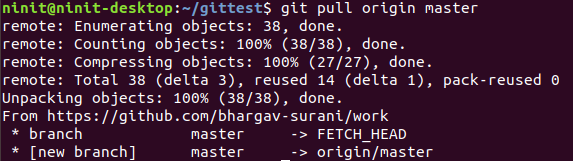
 
 4. To show pulled files use command "ls". for intial condition git status shows nothing to commit. For showing git status use following command.
 ```
   git status
 ```
 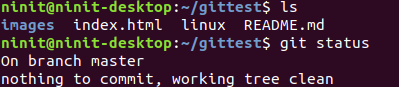
 
 5. Now, in case if any changes made in any file git status shows modified file in red latters.
 
 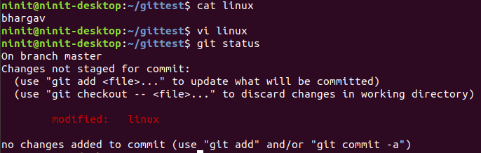

 6. Now for adding these changes or save in working directory use "git add" command. After git add status of file show in green latter. 
 ```
   git add <file name>
   ```
 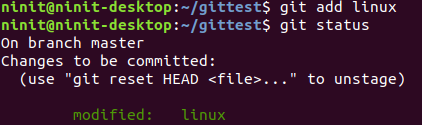

 7. In git status if file name in green latter that means it is ready to commit. commit does changes in local git repository.
 ```
   git commit -m "message"
 ```
 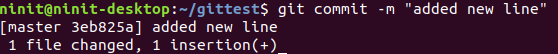
 
 8. Now update these changes to git repository use "git push" command.
 ```
   git push origin master
   ```
 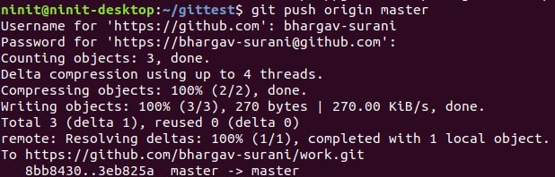
 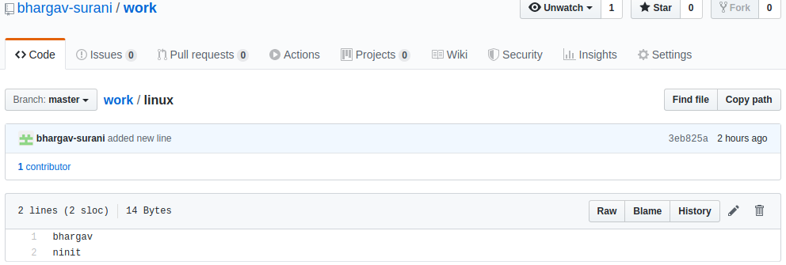
 
 9. for change branch of git repository use "checkout" command.
 ```
   git checkout  <Branch name>
   ```
 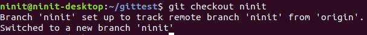
 
 10. now if any changes made in any branch and for merge these changes use "git merge" command.
 ```
   git merge <Branch Name>
   ```
 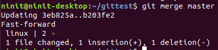
