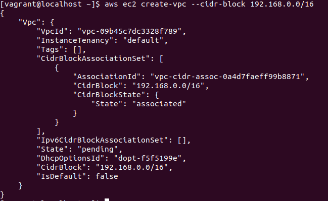
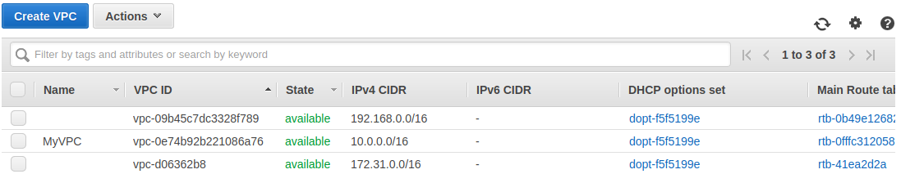
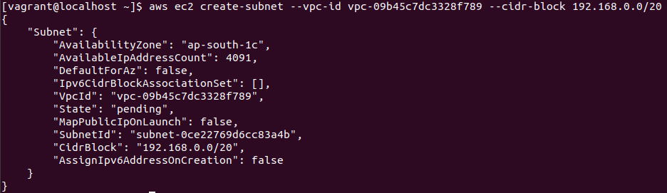
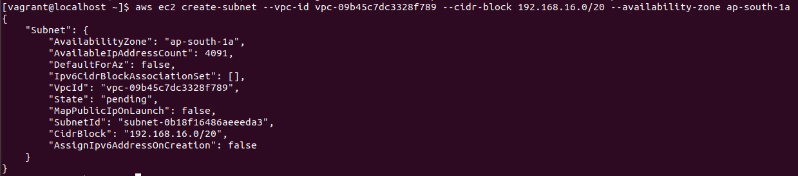

# Create VPC and Subnet using AWS cli.

1. To create VPC using AWS cli use command “create-vpc”. And for a specified range of IPv4 CIDR block use “--cidr-block”.
```
  aws ec2 create-vpc --cidr-block <value>
  ```
  
   
   
   
   
   
   
   
2. Now to create a subnet use the “create-subnet” command. For that we specify in which VPC we are creating subnet and IPv4   CIDR range.
```
  aws ec2 create-subnet --vpc-id <value> --cidr-block <value>
  ```
  
   
   
   
  
3. Now if we want to create a subnet in a specific availability zone use the ”--availability-zone” command.
```
  --availability-zone
  ```
  
   
   
   


