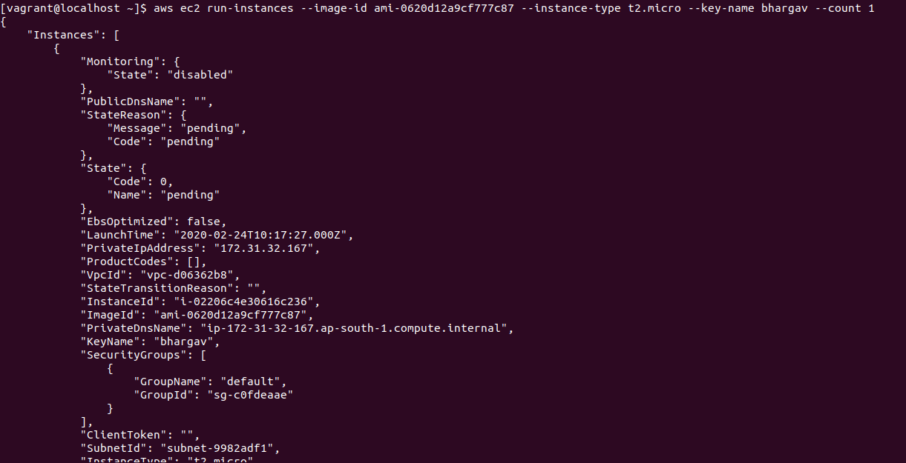
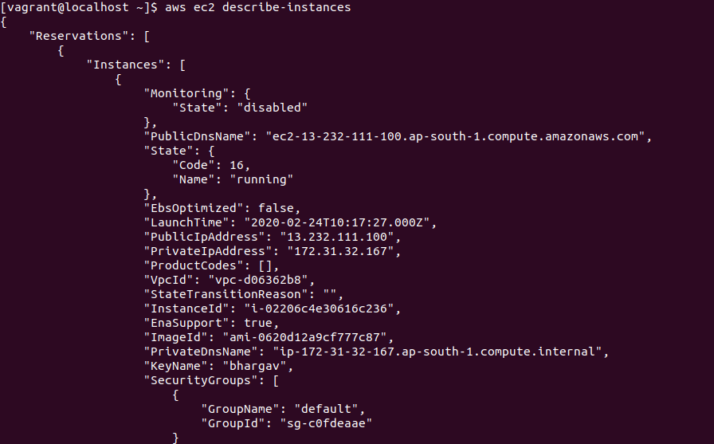
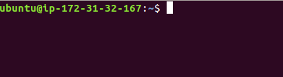

## EC2 Instance Launch using awscli

step-1 : open command line .

step-2 : To launch ec2 instance using aws cli use the "run-instance" command.
```bash
 aws ec2 run-instance --image-id <value> --instance-type <value> --key-name <value>
 ```
 
 for launching instance, to specify differnet parameters there is different type of command use "--subnet-id", "--security-groups", "--count" etc.
 
 
  
  
step-3 : To view launched ec2 instances use  "describe-instances"
```bash
 aws ec2 describe-instances 
 ```
 
  
  
step-4 : now, for access instance using ssh we need secret key and public ip.

```bash
ssh -i <key name> username@public ip
```

 
 
 
 
